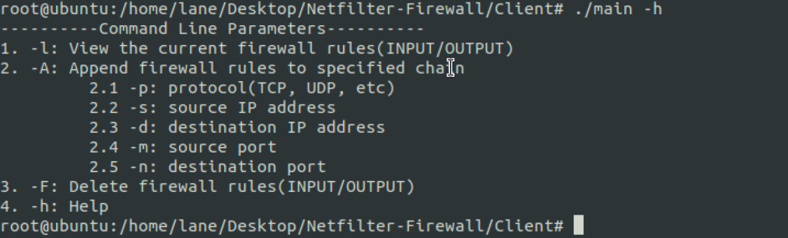

# Netfilter-Firewall

## 简介

防火墙是一种保护网络安全的技术，它可以阻止不希望的，未授权的通信进出被保护的网络。本项目主要实现了了基于Netfilter开发的静态包过滤防火墙，在结构上设计了针对输入链和输出链的过滤功能，实现了对符合指定的网络协议、源IP地址、目的IP地址、源端口和目的端口的报文进行阻止。用户态和内核态的通信采取了编写字符设备的方式，使得用户能够从命令行参数指定过滤规则、查看当前规则以及规则清空等操作，并提供了简要的前端帮助文档，基本实现简要防火墙功能。

## 系统功能

本防火墙系统功能实现主要分两个板块罗列：内核模块和客户端交互模块。

### 2.1 内核模块

内核模块主要实现了下述功能点：

1. 防火墙功能：对符合规则策略的包进行过滤
2. 配置的规则链实现了双链：INPUT链和OUTPUT链，分别挂载在NF_INET_PRE_ROUTING和NF_INET_POST_ROUTING两个挂载点。
3. 在内核模块实现了字符设备文件驱动，包括对字符设备的读写删功能。

### 2.2 客户端交互模块

客户端交互模块主要实现了下述功能点：

1. 命令行规则配置(每条链规则数量上限5条)
2. 当前防火墙规则输出显示
3. 防火墙规则删除(清空某条链上所有规则)
4. 命令行参数使用指南(帮助文档)
5. 友好的前端提示

## 系统开发的软硬件环境

实验所用主机操作系统：MacOS12.6.1

实验所用虚拟机：Ubuntu Linux 20.04

GCC版本：9.4.0(Ubuntu 9.4.0-1ubuntu1～20.04.1)

## 测试

1. clone本项目至虚拟机目录下

2. 执行`cd /dev`进入系统设备文件夹

3. 执行如下三条命令完成字符设备的注册：

   - `mknod inputRules c 124 0`

   - `mknod outputRules c 125 0`

   - `mknod Delete c 126 0`

4. `cd 项目文件夹/LKM`

5. 编译内核模块：`make`

6. 插入内核模块：`sudo insmod filter.ko`

7. `cd 项目文件夹/Client`

8. 编译：`gcc -o main main.c`

9. 执行`./main -h`查看帮助文档即可开始配置防火墙规则

   

10. `dmesg`可查看系统日志(含防火墙过滤信息)

11. 移除内核模块：`sudo rmmod filter`

## 说明

本项目实现参考了项目 [Firewall-Based-on-Netfilter](https://github.com/mryuan0428/Firewall-Based-on-Netfilter)，在此思路基础上进一步根据需求进行改进和开发，深表感谢！

项目如果有 bug 或者 feature request 欢迎提 issue or pr!

